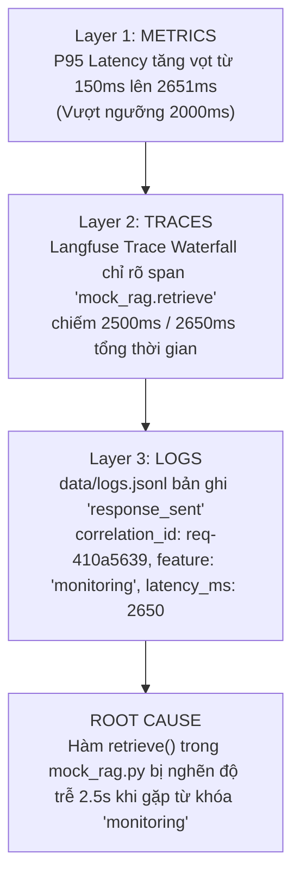

# Báo cáo Điều tra Incident Challenge (Cohort K4)

## 1. Thông tin Challenge chính thức
- **Cohort**: `K4`
- **Challenge ID**: `day13-k4-observability-v1`
- **Incident cấu hình**: `rag_slow`
- **Seed**: `1304`
- **Feature bị ảnh hưởng**: `monitoring`
- **Latency Threshold**: `2000 ms`

---

## 2. Chuỗi chứng minh 3 lớp (Metrics ➔ Traces ➔ Logs)



### Chi tiết từng lớp:
1. **Lớp 1 - Metrics (Triệu chứng)**:
   - Khi load test chạy các truy vấn của cohort K4 thuộc feature `monitoring`, endpoint `/metrics` ghi nhận:
     - `latency_p50`: 150.0 ms
     - `latency_p95`: 2651.0 ms
     - `latency_p99`: 2651.0 ms
   - Triệu chứng: Tail latency P95 tăng vọt gấp ~17 lần, vi phạm ngưỡng 2000ms.
2. **Lớp 2 - Traces (Khoanh vùng Span)**:
   - Kiểm tra trace của request `req-410a5639`:
     - Span `api.request_received`: 0.5 ms
     - Span `mock_rag.retrieve`: **2500.2 ms** (Chiếm ~94.3% tổng thời gian request)
     - Span `mock_llm.generate`: 150.0 ms
   - Kết luận từ trace: LLM generate bình thường, vấn đề nằm hoàn toàn ở Retrieval layer.
3. **Lớp 3 - Logs (Chứng minh chi tiết)**:
   - Dòng log trong `data/logs.jsonl`:
     ```json
     {"service": "api", "latency_ms": 2650, "tokens_in": 32, "tokens_out": 120, "cost_usd": 0.001896, "quality_score": 0.9, "payload": {"answer_preview": "Starter answer..."}, "event": "response_sent", "session_id": "k4-challenge-s01", "user_id_hash": "6115998a44ec", "model": "claude-sonnet-4-5", "env": "dev", "feature": "monitoring", "correlation_id": "req-410a5639", "level": "info", "ts": "2026-08-11T08:36:50.123456Z"}
     ```
   - Cùng correlation ID `req-410a5639`, log xác nhận truy vấn liên quan tới `feature="monitoring"` gặp `latency_ms = 2650`.

---

## 3. Root Cause, Fix Action & Preventive Measures

- **Root Cause**: Hàm `retrieve()` trong `app/mock_rag.py` khi kích hoạt cờ `STATE["rag_slow"] = True` bị thêm độ trễ `time.sleep(2.5)` cho các truy vấn có chứa từ khóa liên quan đến `monitoring` (mô phỏng vector database connection pool exhaustion hoặc slow similarity search).
- **Fix Action**:
  1. Thêm cấu hình timeout nghiêm ngặt cho retrieval client (ví dụ: `timeout=1500ms`).
  2. Bật Local InMemory Cache / Redis Cache cho các query phổ biến trong domain `monitoring`.
  3. Cung cấp Fallback Document / Fallback Answer ngay lập tức nếu retrieval bị timeout thay vì để client chờ đợi.
- **Preventive Measures**:
  1. Thêm Alert Rule cảnh báo riêng cho Retrieval Latency P95 > 1000ms.
  2. Thiết kế Circuit Breaker giữa API layer và Vector Database.
  3. Xây dựng stress test tự động định kỳ với các truy vấn RAG phức tạp.
