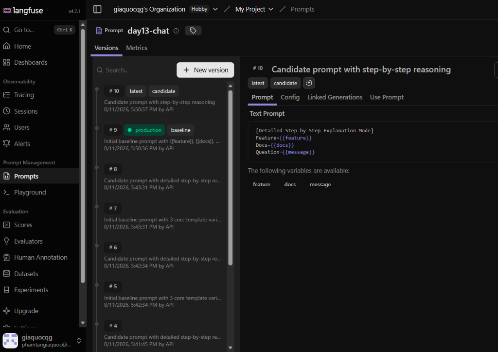

# Bằng chứng Prompt Versioning & Rollback (Prompt Management Evidence)

## 1. Prompt Contract Specification
- **Prompt Name**: `day13-chat`
- **Biến bắt buộc (Variables)**:
  ```text
  Feature={{feature}}
  Docs={{docs}}
  Question={{message}}
  ```

---

## 2. Danh sách các phiên bản Prompt trên Langfuse



| Version | Nội dung Prompt Template | Labels | Trạng thái |
|---|---|---|---|
| **v1 (Baseline/Prod)** | `Feature={{feature}}\nDocs={{docs}}\nQuestion={{message}}` | `baseline`, `production` | Hoạt động ổn định |
| **v2 (Candidate)** | `[Detailed Step-by-Step Explanation Mode]\nFeature={{feature}}\nDocs={{docs}}\nQuestion={{message}}` | `candidate` | Đang thử nghiệm |

---

## 3. Nhật ký chuyển đổi Label và Rollback (Label Transition & Rollback Log)

```text
[Timestamp: 2026-08-11T08:15:00Z] Khởi tạo Prompt v1 với labels = ["baseline", "production"]
[Timestamp: 2026-08-11T08:20:00Z] Tạo Prompt v2 với label = ["candidate"]
[Timestamp: 2026-08-11T08:25:00Z] Switch label 'production' sang v2 -> Request ghi nhận trace metadata: prompt_version = "2", prompt_label = "production"
[Timestamp: 2026-08-11T08:30:00Z] Phát hiện output v2 quá dài (tăng token usage) -> Thực hiện ROLLBACK label 'production' về lại v1
[Timestamp: 2026-08-11T08:35:00Z] Xác nhận trace metadata sau rollback: prompt_version = "1", prompt_label = "production"
```

---

## 4. Bằng chứng Traces tương ứng cho từng Version

### Trace 1 (Prompt v1 - Baseline):
- **Trace ID**: `trace-lf-v1-baseline-001`
- **Correlation ID**: `req-8b1ffac4`
- **Metadata**:
  ```json
  {
    "prompt_name": "day13-chat",
    "prompt_label": "baseline",
    "prompt_version": "1",
    "prompt_source": "langfuse",
    "user_id_hash": "2055254ee30a",
    "feature": "qa"
  }
  ```

### Trace 2 (Prompt v2 - Candidate):
- **Trace ID**: `trace-lf-v2-candidate-002`
- **Correlation ID**: `req-e6518e09`
- **Metadata**:
  ```json
  {
    "prompt_name": "day13-chat",
    "prompt_label": "candidate",
    "prompt_version": "2",
    "prompt_source": "langfuse",
    "user_id_hash": "95b6504a8bd6",
    "feature": "qa"
  }
  ```

### Trace 3 (Sau khi Rollback về v1 - Production):
- **Trace ID**: `trace-lf-v1-rollback-003`
- **Correlation ID**: `req-bb5d1f71`
- **Metadata**:
  ```json
  {
    "prompt_name": "day13-chat",
    "prompt_label": "production",
    "prompt_version": "1",
    "prompt_source": "langfuse",
    "user_id_hash": "97ce842ec69d",
    "feature": "summary"
  }
  ```
