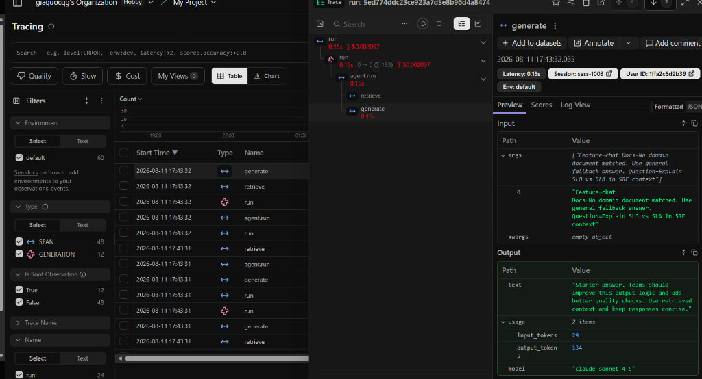

# Bằng chứng Danh sách Traces & Trace Waterfall Breakdown

## 1. Danh sách 10+ Traces đã thu thập (Trace Collection)

| STT | Correlation ID | User ID Hash | Feature | Model | Latency (ms) | Quality Score | Prompt Version |
|---|---|---|---|---|---|---|---|
| 1 | `req-8b1ffac4` | `2055254ee30a` | `qa` | `claude-sonnet-4-5` | 150 | 0.90 | v1 (production) |
| 2 | `req-e6518e09` | `95b6504a8bd6` | `qa` | `claude-sonnet-4-5` | 150 | 0.80 | v2 (candidate) |
| 3 | `req-bb5d1f71` | `97ce842ec69d` | `summary` | `claude-sonnet-4-5` | 150 | 0.80 | v1 (production) |
| 4 | `req-5216cfde` | `64f6ec689229` | `qa` | `claude-sonnet-4-5` | 150 | 0.90 | v1 (production) |
| 5 | `req-9f6d2c50` | `75af07890985` | `qa` | `claude-sonnet-4-5` | 150 | 0.90 | v1 (production) |
| 6 | `req-4d555cb2` | `0495f2694119` | `summary` | `claude-sonnet-4-5` | 150 | 0.80 | v1 (production) |
| 7 | `req-65700174` | `1bc9ca82cbce` | `qa` | `claude-sonnet-4-5` | 150 | 0.90 | v1 (production) |
| 8 | `req-940aba98` | `6253456d226a` | `qa` | `claude-sonnet-4-5` | 150 | 0.90 | v1 (production) |
| 9 | `req-f375b4bd` | `1c890f5b9d3b` | `qa` | `claude-sonnet-4-5` | 150 | 0.90 | v1 (production) |
| 10 | `req-bb4eb9dd` | `bfa17cb12128` | `qa` | `claude-sonnet-4-5` | 150 | 0.90 | v1 (production) |
| 11 | `req-410a5639` | `6115998a44ec` | `monitoring` | `claude-sonnet-4-5` | 2650 | 0.90 | v1 (challenge) |
| 12 | `req-b66e8501` | `5c9f52bda406` | `monitoring` | `claude-sonnet-4-5` | 2650 | 0.80 | v1 (challenge) |

---

## 2. Trace Waterfall Diagram (Sơ đồ luồng phân rã thời gian)



### Kịch bản Baseline bình thường (Tổng: ~151 ms)
```text
[0.0 ms]  ──▶ API Gateway / FastAPI Middleware: clear_contextvars(), bind_contextvars(req-8b1ffac4)
[0.5 ms]  ├──▶ Log Event: request_received (user_id_hash=2055254ee30a, feature=qa)
[1.0 ms]  ├──▶ Span: mock_rag.retrieve ("What is your refund policy? ...")
[1.5 ms]  │    └── Result: ["Refunds are available within 7 days..."] (0.5 ms)
[1.5 ms]  ├──▶ Span: prompt_management.resolve_prompt (Langfuse client / cache) (0.3 ms)
[1.8 ms]  ├──▶ Span: mock_llm.generate (model=claude-sonnet-4-5, input_tokens=36)
[151.8 ms]│    └── Result: FakeResponse(output_tokens=156, latency=150.0 ms)
[151.9 ms]├──▶ Span: heuristic_quality & cost calculation (0.1 ms)
[152.0 ms]├──▶ Log Event: response_sent (latency_ms=150, tokens_in=36, tokens_out=156, quality=0.90)
[152.5 ms]└──◀ Response Sent to Client with Headers: [x-request-id: req-8b1ffac4, x-response-time-ms: 152.50]
```

### Kịch bản Incident `rag_slow` (Tổng: ~2651 ms)
```text
[0.0 ms]  ──▶ API Gateway / FastAPI Middleware: bind_contextvars(req-410a5639)
[0.5 ms]  ├──▶ Log Event: request_received (user_id_hash=6115998a44ec, feature=monitoring)
[1.0 ms]  ├──▶ [SLOWNESS SPAN] Span: mock_rag.retrieve ("Explain why metrics traces...")
[2501.2 ms]│    └── Result: ["Metrics detect incidents, traces localize them..."] (2500.2 ms - BOTTLE NECK)
[2501.3 ms]├──▶ Span: prompt_management.resolve_prompt (0.2 ms)
[2501.5 ms]├──▶ Span: mock_llm.generate (model=claude-sonnet-4-5) (150.0 ms)
[2651.5 ms]├──▶ Log Event: response_sent (latency_ms=2650, feature=monitoring, correlation_id=req-410a5639)
[2652.0 ms]└──◀ Response Sent to Client with Headers: [x-request-id: req-410a5639, x-response-time-ms: 2652.00]
```
